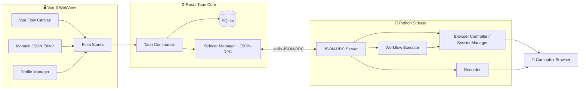

<p align="center">
  <strong>Mimicry</strong>
</p>

<p align="center">
  <strong>A local-first desktop workspace for visual browser automation</strong>
</p>

<p align="center">
  <a href="https://github.com/51hhh/Mimicry/actions/workflows/pipeline.yml">
    
  </a>
  <a href="https://github.com/51hhh/Mimicry/actions/workflows/release.yml">
    
  </a>
  <a href="https://github.com/51hhh/Mimicry/releases/latest">
    
  </a>
</p>

<p align="center">
  <a href="README.md">English</a> | <a href="docs/README.zh-CN.md">中文</a>
</p>

---

> Status: **Alpha / MVP**. The desktop shell, workflow canvas, browser sidecar, recorder, executor, profile storage, and multi-session groundwork are in place. Several advanced workflow semantics described in the design docs are still being implemented — see the [Roadmap](#roadmap).

## What is Mimicry?

Mimicry is a desktop browser automation app built with **Tauri v2 + Vue 3 + Rust + a Python sidecar**. It lets you build browser workflows visually, record real browser interactions, edit the workflow JSON directly, and launch isolated browser profiles with their own data directory and runtime configuration.

It is designed for local automation — browser testing, repetitive web operations, profile-isolated workflows, reproducible browser environments — and keeps all automation state on your machine instead of in a hosted service.

## Features

- **Visual workflow editor** — Vue Flow canvas with draggable action, condition, loop, and group nodes
- **JSON workflow editing** — Monaco editor with canvas synchronization groundwork
- **Browser sidecar** — Rust talks to a Python sidecar over JSON-RPC 2.0 via stdio
- **Camoufox integration** — Launch flow, environment check, installer, runtime warnings
- **Recording & playback** — Capture real browser interactions and import them as workflow nodes
- **Workflow executor** — Python engine for browser, interaction, data, control, download, cookie, and transform actions
- **Profile management** — SQLite-backed CRUD with per-profile `user_data_dir`, proxy, OS target, and browser config
- **Session groundwork** — `SessionManager` in the sidecar plus frontend session state for multiple concurrent browsers
- **Local persistence** — SQLite for workflows, recent files, settings, and profiles
- **Desktop UX** — Custom Tauri shell, ActivityBar/Sidebar layout, settings view, update notifier, i18n (en / zh-CN), HiDPI-aware window sizing

## Roadmap

Listed honestly as roadmap, not as shipped features:

- **Workflow schema hardening** — Stricter validation, migration diagnostics, and frontend conversion tests for the canonical `kind + action + data + settings` format
- **Graph execution semantics** — How edges, handles, branches, joins, and loop ports drive execution order
- **Profile/session product polish** — Running-profile status, deletion safeguards, active-session display, manual test coverage
- **Workflow validation** — Schema validation, migration helpers, invalid-node diagnostics, safer JSON editing
- **Selector self-healing** — Expand selector scoring into runtime fallback and repair flows
- **Package / sub-workflow system** — Reusable grouped workflow blocks with explicit IO contracts
- **Quality gates** — Keep frontend lint/typecheck, Rust checks, and sidecar tests consistently green in CI

## Quick Start

### Prerequisites

- Rust toolchain
- Node.js ≥ 20 and pnpm ≥ 10
- Python ≥ 3.10
- Tauri v2 system dependencies for your platform

On Ubuntu / Debian:

```bash
sudo apt install -y \
  libwebkit2gtk-4.1-dev build-essential curl wget file \
  libxdo-dev libssl-dev libayatana-appindicator3-dev librsvg2-dev pkg-config

cargo install tauri-cli --version "^2"
```

### Run from source

```bash
git clone https://github.com/51hhh/Mimicry.git
cd Mimicry

pnpm install
cargo tauri dev
```

`cargo tauri dev` starts the Vite frontend through `pnpm dev` and launches the Rust desktop shell.

### Build

```bash
pnpm build
cargo tauri build
```

Build artifacts appear under `src-tauri/target/release/bundle/`.

### Sidecar environment

The Python sidecar drives the browser. In development the app can create and use a sidecar virtual environment under the app data directory; the browser setup UI checks for Camoufox and guides installation when missing. Dependencies live in:

- `sidecar/requirements.txt`
- `sidecar/requirements-dev.txt`

## Tech Stack

| Layer | Technology |
|-------|-----------|
| Desktop shell | [Tauri v2](https://v2.tauri.app/) |
| Rust backend | Tauri commands, [rusqlite](https://github.com/rusqlite/rusqlite), JSON-RPC client, `tracing` |
| Frontend | [Vue 3](https://vuejs.org/), Vite, TypeScript, Pinia, [Vue Flow](https://vueflow.dev/), [Monaco](https://microsoft.github.io/monaco-editor/), Tailwind CSS |
| Browser automation | Python, [Camoufox](https://github.com/daijro/camoufox), Playwright APIs |
| IPC | Tauri invoke/events + JSON-RPC 2.0 over stdio |
| Storage | SQLite |
| Packaging | Tauri bundler + Python sidecar packaging groundwork |

## Architecture



## Project Structure

```
src/                         # Vue frontend
├── components/              # UI, layout, editor, workflow node components
├── composables/             # Reusable composition utilities
├── locales/                 # en / zh-CN translations
├── stores/                  # Pinia stores (browser, workflow, profiles, settings)
├── types/                   # TypeScript contracts
└── views/                   # Editor and settings views

src-tauri/src/               # Rust backend
├── commands/                # Tauri command handlers
├── db/                      # SQLite schema and data access
├── ipc/                     # Sidecar process and JSON-RPC client
├── error.rs                 # AppError / AppResult
├── lib.rs                   # Tauri initialization
└── logger.rs                # tracing setup

sidecar/                     # Python automation runtime
├── browser/                 # Camoufox controller, actions, recorder, profiles
├── engine/                  # Workflow executor, action mapping
├── rpc/                     # JSON-RPC server, method registry
├── tests/                   # Sidecar unit / e2e tests
└── main.py                  # Entry point

docs/                        # Architecture, design notes, workflow docs
shared/                      # Shared action map and cross-layer metadata
scripts/                     # Development scripts
```

## Development

```bash
# Frontend
pnpm typecheck
pnpm lint

# Rust
cd src-tauri && cargo check
cd src-tauri && cargo test --all-targets --all-features
cd src-tauri && cargo clippy --all-targets --all-features -- -D warnings

# Python sidecar (after activating its virtualenv)
cd sidecar && python -m pytest
```

Current quality status, kept honest:

- Frontend `pnpm lint` and `pnpm typecheck` pass.
- Rust compiles cleanly; there are currently **no** Rust unit tests.
- Python sidecar executor and action-map tests pass in the configured sidecar virtualenv.

## Contributing

Contributions are welcome. Please open an issue first to discuss substantial changes.

1. Fork the repository
2. Create your feature branch (`git checkout -b feat/amazing-feature`)
3. Commit your changes (`git commit -m 'feat: add amazing feature'`)
4. Push to the branch (`git push origin feat/amazing-feature`)
5. Open a Pull Request

Before adding new features, please prefer stabilizing existing core contracts: keep README and docs aligned with implemented behavior, keep workflow / Block JSON schemas explicit and migration-friendly, and add tests for cross-layer contracts.

## Documentation

- [Documentation index](./docs/README.md)
- [Architecture overview](./docs/architecture.md)
- [Block system design](./docs/design/block-system.md)
- [Data flow design](./docs/design/data-flow.md)

## Credits

Built with these open-source projects:

- [Tauri](https://tauri.app/) — desktop app framework
- [Vue](https://vuejs.org/) — frontend framework
- [Vue Flow](https://vueflow.dev/) — visual node editor
- [Monaco Editor](https://microsoft.github.io/monaco-editor/) — JSON editing
- [Camoufox](https://github.com/daijro/camoufox) — browser automation runtime
- [Playwright](https://playwright.dev/) — browser automation APIs
- [rusqlite](https://github.com/rusqlite/rusqlite) — SQLite bindings for Rust

## License

No `LICENSE` file is currently present in this repository. Add one before public distribution.
