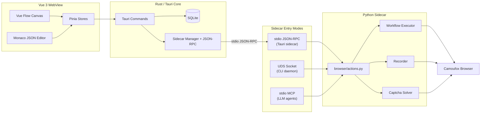

<p align="center">
  
</p>

<p align="center">
  <strong>A local-first desktop workspace for visual browser automation</strong>
</p>

<p align="center">
  <a href="https://github.com/xia51hhh/Mimicry/actions/workflows/pipeline.yml">
    
  </a>
  <a href="https://github.com/xia51hhh/Mimicry/actions/workflows/release.yml">
    
  </a>
  <a href="https://github.com/xia51hhh/Mimicry/releases/latest">
    
  </a>
  <a href="https://github.com/xia51hhh/Mimicry/releases">
    
  </a>
</p>

<p align="center">
  <a href="README.md">English</a> | <a href="docs/README.zh-CN.md">中文</a>
</p>

---

Mimicry is a desktop app that lets you **build, record, and run browser automation visually** — drag nodes on a canvas, edit the underlying JSON in Monaco, hit play. Workflows execute against [Camoufox](https://github.com/daijro/camoufox), an anti-detect Firefox fork driven through Playwright.

Everything runs on your machine. No cloud, no telemetry, no account.

Built with **Tauri v2 + Vue 3 + Rust + Python**.

## Highlights

- **Visual workflow editor** with [Vue Flow](https://vueflow.dev/) canvas — drag actions, conditions, loops, and groups
- **Anti-detect browser** powered by Camoufox (Firefox fork with C++ engine-level fingerprint patches)
- **Three-mode sidecar, one action surface** — drive the browser from Tauri (stdio JSON-RPC), CLI daemon, or as an MCP server for LLM agents
- **52 MCP tools** auto-mapped from the RPC registry, ready for Cursor / Claude Desktop / Cline / Windsurf
- **Record & replay** — capture real browser interactions with smart selector generation, import them as workflow nodes
- **Profile isolation** — per-profile `user_data_dir`, proxy, OS target, and browser config; cookies and storage persist across sessions
- **Cloudflare captcha solving** — built-in click solver for Turnstile and Interstitial challenges
- **JSON direct execution** — workflows are plain JSON node graphs (`kind + action + data + settings`), edited in Monaco with live canvas sync
- **Auto update** via GitHub Releases (Tauri updater plugin, with delta downloads and signature verification)
- **HiDPI-aware** window sizing on Windows / macOS / Linux
- **i18n** out of the box — English and 简体中文

## Install

Grab the latest installer from [Releases](https://github.com/xia51hhh/Mimicry/releases/latest).

```bash
# Debian / Ubuntu
sudo dpkg -i Mimicry_*_amd64.deb

# Linux AppImage
chmod +x Mimicry_*.AppImage && ./Mimicry_*.AppImage

# Windows
# Run the .msi or .exe installer
```

## Quick Start

```bash
# Run from source (full stack: Vite frontend + Rust shell + Python sidecar)
cargo tauri dev

# Build release artifacts → src-tauri/target/release/bundle/
cargo tauri build
```

System dependencies (Ubuntu / Debian):

```bash
sudo apt install -y \
  libwebkit2gtk-4.1-dev build-essential curl wget file \
  libxdo-dev libssl-dev libayatana-appindicator3-dev librsvg2-dev pkg-config

cargo install tauri-cli --version "^2"
```

Requires **Rust toolchain · Node.js ≥ 20 · pnpm ≥ 10 · Python ≥ 3.10**.

## Drive It With an LLM (MCP)

Mimicry doubles as an MCP server. Point any MCP-compatible client at the sidecar:

```jsonc
// ~/.cursor/mcp.json (or Claude Desktop / Cline / Windsurf equivalent)
{
  "mcpServers": {
    "mimicry": {
      "command": "python",
      "args": ["/path/to/Mimicry/sidecar/main.py", "--mcp"],
    },
  },
}
```

You now have 52 browser tools (`browser_launch`, `browser_navigate`, `browser_click`, `captcha_solve_cloudflare`, …) plus their full parameter docs in the LLM's context. Ask the assistant to "open a stealth browser, search for X, take a screenshot" and it will.

Prefer a CLI? The sidecar also runs as a daemon with a thin client:

```bash
sidecar/cli.py daemon start
sidecar/cli.py launch
sidecar/cli.py navigate https://example.com
sidecar/cli.py screenshot /tmp/page.png
```

See [`sidecar/SKILL.md`](sidecar/SKILL.md) for the full LLM-facing CLI reference and [`docs/llm-interactive-guide.md`](docs/llm-interactive-guide.md) for patterns.

## Tech Stack

| Layer          | Technology                                                                                                                                      |
| -------------- | ----------------------------------------------------------------------------------------------------------------------------------------------- |
| Desktop shell  | [Tauri v2](https://v2.tauri.app/)                                                                                                               |
| Frontend       | [Vue 3](https://vuejs.org/) · [Vite](https://vitejs.dev/) · TypeScript · [Pinia](https://pinia.vuejs.org/)                                      |
| Canvas         | [Vue Flow](https://vueflow.dev/) + [Dagre](https://github.com/dagrejs/dagre) auto-layout                                                        |
| Code editor    | [Monaco](https://microsoft.github.io/monaco-editor/)                                                                                            |
| Styling        | [Tailwind CSS v4](https://tailwindcss.com/) · [vue-i18n](https://vue-i18n.intlify.dev/)                                                         |
| Rust core      | Tauri commands · [rusqlite](https://github.com/rusqlite/rusqlite) · [tracing](https://github.com/tokio-rs/tracing) · [tokio](https://tokio.rs/) |
| Browser engine | [Camoufox](https://github.com/daijro/camoufox) (anti-detect Firefox)                                                                            |
| Browser API    | [Playwright](https://playwright.dev/)                                                                                                           |
| LLM bridge     | [Model Context Protocol (Python SDK)](https://github.com/modelcontextprotocol/python-sdk)                                                       |
| IPC            | Tauri invoke / events + JSON-RPC 2.0 over stdio + Unix Domain Socket (CLI daemon)                                                               |
| Storage        | SQLite (via rusqlite, FTS-ready)                                                                                                                |
| Logging        | [`tracing`](https://github.com/tokio-rs/tracing) (Rust) + [`loguru`](https://github.com/Delgan/loguru) (Python)                                 |
| Packaging      | Tauri bundler + PyInstaller (sidecar)                                                                                                           |

## Architecture



All three sidecar entry modes — Tauri sidecar, CLI daemon, MCP server — share the same `sidecar/browser/actions.py` adapter and `sidecar/rpc/methods.py` registry. New browser capabilities ship to all three at once.

## Workflow Format

Workflows are JSON node graphs. No DSL, no proprietary format.

```json
{
  "id": "demo",
  "nodes": [
    {
      "id": "n1",
      "kind": "action",
      "action": "open",
      "data": { "url": "https://example.com" },
      "settings": { "timeout": 30000 }
    },
    {
      "id": "n2",
      "kind": "action",
      "action": "click",
      "data": { "selector": "a[href='/login']" }
    }
  ],
  "edges": [{ "source": "n1", "target": "n2" }]
}
```

The full schema (kinds, actions, settings, runtime routing, condition / loop / group semantics) is documented in [`docs/design/block-system.md`](docs/design/block-system.md) and [`.trellis/spec/cross-layer/block-schema.md`](.trellis/spec/cross-layer/block-schema.md).

## Project Structure

```
src/                          # Vue 3 frontend
├── components/               # Layout, editor, workflow node, UI components
├── composables/              # File ops, keyboard shortcuts, panel state
├── locales/                  # en.json, zh-CN.json
├── stores/                   # Pinia stores (browser, workflow, profiles, settings, …)
├── types/                    # Cross-layer TypeScript contracts
└── views/                    # EditorView, SettingsView

src-tauri/src/                # Rust core
├── commands/                 # Tauri command handlers
├── db/                       # SQLite schema + access
├── ipc/                      # Sidecar process + JSON-RPC client
├── transform/                # Workflow format conversion (4-way)
├── workflow_validator.rs     # JSON schema validator
└── lib.rs                    # Tauri init + plugin setup

sidecar/                      # Python automation runtime
├── main.py                   # Entry: --mcp / --daemon / stdio (default)
├── browser/                  # Camoufox controller, actions, recorder, profile, env check
├── engine/                   # Workflow executor, action map, condition parser
├── captcha/                  # Cloudflare click solver (adapted from techinz/playwright-captcha)
├── rpc/                      # JSON-RPC server, method registry
├── cli.py + daemon.py        # CLI client + UDS daemon
├── mcp_server.py             # MCP stdio server (auto-maps RPC → tools)
└── tests/                    # Sidecar unit + e2e tests

shared/action-map.json        # Cross-layer action name source of truth
docs/                         # Architecture, design ADRs, dev guides
```

## Development

```bash
cargo tauri dev               # Full stack (Vite :1420 + Rust shell)
pnpm typecheck && pnpm lint   # Frontend gates
pnpm format                   # Prettier auto-fix
cd src-tauri && cargo clippy --all-targets --all-features -- -D warnings
cd src-tauri && cargo test --all-targets --all-features
cd sidecar    && python -m pytest tests/ -v -m "not e2e"
python scripts/sync-action-map.py   # Cross-layer contract check
```

CI enforces all of the above. See [`CLAUDE.md`](CLAUDE.md) for the full developer guide and conventions.

## Contributing

Contributions welcome. Please open an issue first to discuss substantial changes.

1. Fork → branch (`git checkout -b feat/my-feature`)
2. Commit (`git commit -m 'feat: add my feature'`)
3. Push → Pull Request

Before working on a feature, prefer stabilizing existing core contracts: keep workflow JSON schemas migration-friendly, add tests for cross-layer contracts, and update [`shared/action-map.json`](shared/action-map.json) when introducing new action names.

## Credits

Mimicry stands on the shoulders of these excellent projects:

**Desktop & UI**

- [Tauri](https://tauri.app/) — Smaller, faster, more secure desktop apps (MIT / Apache-2.0)
- [Vue](https://vuejs.org/) · [Vue Flow](https://vueflow.dev/) · [Vue Router](https://router.vuejs.org/) · [Pinia](https://pinia.vuejs.org/) (MIT)
- [Vite](https://vitejs.dev/) · [Vitest](https://vitest.dev/) (MIT)
- [Monaco Editor](https://microsoft.github.io/monaco-editor/) (MIT)
- [Tailwind CSS](https://tailwindcss.com/) · [vue-i18n](https://vue-i18n.intlify.dev/) · [Lucide Icons](https://lucide.dev/) (MIT)
- [Dagre](https://github.com/dagrejs/dagre) — graph layout (MIT)

**Browser automation**

- [Camoufox](https://github.com/daijro/camoufox) — anti-detect Firefox fork (**MPL-2.0**)
- [Playwright](https://playwright.dev/) — browser automation API (Apache-2.0)
- [techinz/playwright-captcha](https://github.com/techinz/playwright-captcha) — Cloudflare click solver code adapted into `sidecar/captcha/cloudflare.py` (Apache-2.0, see file header for upstream commit)

**Rust core**

- [rusqlite](https://github.com/rusqlite/rusqlite) — SQLite for Rust (MIT)
- [tokio](https://tokio.rs/) · [serde](https://serde.rs/) · [tracing](https://github.com/tokio-rs/tracing) · [thiserror](https://github.com/dtolnay/thiserror) (MIT / Apache-2.0)

**Python sidecar**

- [loguru](https://github.com/Delgan/loguru) — logging (MIT)
- [Model Context Protocol Python SDK](https://github.com/modelcontextprotocol/python-sdk) (MIT)

**Inspiration**

- [Automa](https://github.com/AutomaApp/automa) · [n8n](https://github.com/n8n-io/n8n) — visual workflow patterns
- [whit3rabbit/camoufox-mcp](https://github.com/whit3rabbit/camoufox-mcp) · [WhiteNightShadow/camoufox-reverse-mcp](https://github.com/WhiteNightShadow/camoufox-reverse-mcp) · [saifyxpro/HeadlessX](https://github.com/saifyxpro/HeadlessX) · [foxhui/WebAI2API](https://github.com/foxhui/WebAI2API) — engineering reference

## License Notes

Mimicry as a project does not yet ship a top-level `LICENSE` file. Until one is added, treat the source as **all rights reserved** for redistribution purposes — but the upstream dependencies above retain their respective licenses, **including the strong copyleft of [Camoufox (MPL-2.0)](https://github.com/daijro/camoufox/blob/main/LICENSE)**. Any redistribution must comply with all upstream terms.

If you plan to fork, redistribute, or build a commercial product on top of Mimicry, please open an issue first so we can finalize a project license that is compatible with all dependencies.

## ⚠️ Legal & Ethics Notice

**Mimicry is provided strictly for educational, research, and personal automation purposes.**

Browser automation and anti-detection tooling can be used responsibly — to test your own sites, automate boring personal workflows, build accessibility tooling, conduct authorized security research — and they can also be misused. **Misuse is not the project's intent and is not supported.**

Before using Mimicry against any service that is not your own, you are responsible for:

- Reading and respecting the target site's **Terms of Service** and `robots.txt`
- Obtaining **explicit authorization** from the site owner where required
- Complying with all applicable laws, including but not limited to:
  - The U.S. **Computer Fraud and Abuse Act (CFAA)** and equivalent statutes in your jurisdiction
  - The EU **GDPR** and other data-protection regulations
  - National-level cybersecurity and unauthorized-access laws (e.g. China **网络安全法 / 数据安全法 / 个人信息保护法**)
- Not using Mimicry to:
  - Bypass paywalls, authentication, or rate limits without authorization
  - Scrape personal data without consent or a lawful basis
  - Conduct denial-of-service, credential stuffing, fraud, or any harassment campaigns
  - Circumvent technical protection measures in violation of local IP / anti-circumvention law

Mimicry's authors and contributors **disclaim all liability** for misuse of this software. Use it the way you would use a network sniffer, a debugger, or a lockpick set — powerful tools that are perfectly legal in the right hands and very much not in the wrong ones.

## Status

This is an actively developed open-source project intended for **learning, research, and personal automation**. Pull requests, issues, and discussions are welcome on [GitHub](https://github.com/xia51hhh/Mimicry).
