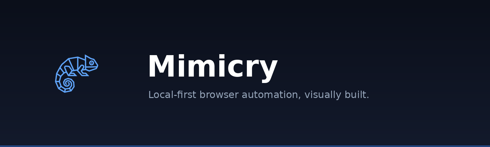
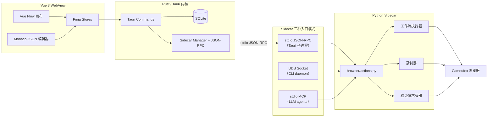

<p align="center">
  
</p>

<p align="center">
  <strong>本地优先的可视化浏览器自动化桌面工作台</strong>
</p>

<p align="center">
  <a href="https://github.com/xia51hhh/Mimicry/actions/workflows/pipeline.yml">
    
  </a>
  <a href="https://github.com/xia51hhh/Mimicry/actions/workflows/release.yml">
    
  </a>
  <a href="https://github.com/xia51hhh/Mimicry/releases/latest">
    
  </a>
  <a href="https://github.com/xia51hhh/Mimicry/releases">
    
  </a>
</p>

<p align="center">
  <a href="../README.md">English</a> | <a href="README.zh-CN.md">中文</a>
</p>

---

Mimicry 是一款桌面应用，让你**用可视化方式构建、录制、运行浏览器自动化**——在画布上拖拽节点，在 Monaco 中编辑底层 JSON，按下播放即可执行。工作流跑在 [Camoufox](https://github.com/daijro/camoufox) 上——一个带 C++ 引擎层指纹补丁的反检测 Firefox 分支，通过 Playwright 驱动。

一切跑在你自己的机器上：无云端、无遥测、无账号。

技术栈：**Tauri v2 + Vue 3 + Rust + Python**。

## 核心能力

- **可视化工作流编辑器**：基于 [Vue Flow](https://vueflow.dev/) 的画布——可拖拽 action / condition / loop / group 节点
- **反检测浏览器**：内置 Camoufox（Firefox 分支，C++ 引擎层指纹改写）
- **三模式 Sidecar、统一 action 层**：可作为 Tauri 子进程（stdio JSON-RPC）、CLI Daemon、或 MCP Server 给 LLM Agent 使用
- **52 个 MCP 工具**：从 RPC 注册表自动映射，开箱即用 Cursor / Claude Desktop / Cline / Windsurf
- **录制与回放**：捕获真实浏览器交互，智能生成选择器，可直接导入为工作流节点
- **Profile 隔离**：每个 profile 独立 `user_data_dir`、代理、目标 OS、浏览器配置；Cookie 与 Storage 跨 session 持久化
- **Cloudflare 验证码处理**：内置 Turnstile / Interstitial 的 click 求解器
- **JSON 直驱执行**：工作流是纯 JSON 节点图（`kind + action + data + settings`），Monaco 编辑可与画布实时同步
- **自动更新**：通过 GitHub Releases（Tauri updater 插件，支持增量下载与签名校验）
- **HiDPI 自适应**：Windows / macOS / Linux 全平台
- **国际化**：开箱支持 English / 简体中文

## 安装

从 [Releases](https://github.com/xia51hhh/Mimicry/releases/latest) 下载最新安装包。

```bash
# Debian / Ubuntu
sudo dpkg -i Mimicry_*_amd64.deb

# Linux AppImage
chmod +x Mimicry_*.AppImage && ./Mimicry_*.AppImage

# Windows
# 直接运行 .msi 或 .exe 安装包
```

## 快速开始

```bash
# 源码运行（全栈：Vite 前端 + Rust 主进程 + Python sidecar）
cargo tauri dev

# 构建发布产物 → src-tauri/target/release/bundle/
cargo tauri build
```

系统依赖（Ubuntu / Debian）：

```bash
sudo apt install -y \
  libwebkit2gtk-4.1-dev build-essential curl wget file \
  libxdo-dev libssl-dev libayatana-appindicator3-dev librsvg2-dev pkg-config

cargo install tauri-cli --version "^2"
```

需要：**Rust 工具链 · Node.js ≥ 20 · pnpm ≥ 10 · Python ≥ 3.10**

## 让 LLM 直接驱动（MCP）

Mimicry 同时是一个 MCP server。在你的 MCP 客户端里指向 sidecar：

```jsonc
// ~/.cursor/mcp.json （Claude Desktop / Cline / Windsurf 类似）
{
  "mcpServers": {
    "mimicry": {
      "command": "python",
      "args": ["/path/to/Mimicry/sidecar/main.py", "--mcp"],
    },
  },
}
```

LLM 立刻获得 52 个浏览器工具（`browser_launch`、`browser_navigate`、`browser_click`、`captcha_solve_cloudflare` …）以及完整参数文档。让助手"打开一个隐身浏览器，搜索 X，截图"——它就会去做。

更喜欢命令行？sidecar 也可作为 daemon 配薄客户端运行：

```bash
sidecar/cli.py daemon start
sidecar/cli.py launch
sidecar/cli.py navigate https://example.com
sidecar/cli.py screenshot /tmp/page.png
```

完整 CLI 参考见 [`sidecar/SKILL.md`](../sidecar/SKILL.md)，使用模式见 [`docs/llm-interactive-guide.md`](llm-interactive-guide.md)。

## 技术栈

| 层          | 技术                                                                                                                                        |
| ----------- | ------------------------------------------------------------------------------------------------------------------------------------------- |
| 桌面框架    | [Tauri v2](https://v2.tauri.app/)                                                                                                           |
| 前端        | [Vue 3](https://vuejs.org/) · [Vite](https://vitejs.dev/) · TypeScript · [Pinia](https://pinia.vuejs.org/)                                  |
| 画布        | [Vue Flow](https://vueflow.dev/) + [Dagre](https://github.com/dagrejs/dagre) 自动布局                                                       |
| 代码编辑器  | [Monaco](https://microsoft.github.io/monaco-editor/)                                                                                        |
| 样式 / i18n | [Tailwind CSS v4](https://tailwindcss.com/) · [vue-i18n](https://vue-i18n.intlify.dev/)                                                     |
| Rust 内核   | Tauri 命令 · [rusqlite](https://github.com/rusqlite/rusqlite) · [tracing](https://github.com/tokio-rs/tracing) · [tokio](https://tokio.rs/) |
| 浏览器引擎  | [Camoufox](https://github.com/daijro/camoufox)（反检测 Firefox 分支）                                                                       |
| 浏览器 API  | [Playwright](https://playwright.dev/)                                                                                                       |
| LLM 桥接    | [Model Context Protocol（Python SDK）](https://github.com/modelcontextprotocol/python-sdk)                                                  |
| IPC         | Tauri invoke / events + JSON-RPC 2.0 over stdio + UDS（CLI daemon）                                                                         |
| 存储        | SQLite（rusqlite）                                                                                                                          |
| 日志        | [`tracing`](https://github.com/tokio-rs/tracing)（Rust）+ [`loguru`](https://github.com/Delgan/loguru)（Python）                            |
| 打包        | Tauri bundler + PyInstaller（sidecar）                                                                                                      |

## 架构



三种 sidecar 入口模式——Tauri 子进程、CLI daemon、MCP server——共享同一个 `sidecar/browser/actions.py` 适配层与 `sidecar/rpc/methods.py` 注册表。新增浏览器能力会同时出现在三种模式中。

## 工作流格式

工作流就是 JSON 节点图，没有 DSL，没有自定义格式。

```json
{
  "id": "demo",
  "nodes": [
    {
      "id": "n1",
      "kind": "action",
      "action": "Navigate",
      "position": { "x": 0, "y": 0 },
      "data": { "url": "https://example.com" },
      "settings": { "onError": "stop" }
    },
    {
      "id": "n2",
      "kind": "action",
      "action": "Click",
      "position": { "x": 200, "y": 0 },
      "data": { "selector": "a[href='/login']" }
    }
  ],
  "edges": [{ "id": "e1", "source": "n1", "target": "n2" }]
}
```

完整 schema（kind、action、settings、runtime 路由、condition / loop / group 语义）参见 [`docs/block-api.md`](block-api.md) 与 [`docs/design/block-system.md`](design/block-system.md)。

## 项目结构

```
src/                          # Vue 3 前端
├── components/               # 布局、编辑器、节点、UI 组件
├── composables/              # 文件操作、快捷键、面板状态
├── locales/                  # en.json, zh-CN.json
├── stores/                   # Pinia stores（browser / workflow / profiles / settings …）
├── types/                    # 跨层 TypeScript 契约
└── views/                    # EditorView, SettingsView

src-tauri/src/                # Rust 内核
├── commands/                 # Tauri 命令处理
├── db/                       # SQLite schema + 数据访问
├── ipc/                      # Sidecar 进程 + JSON-RPC 客户端
├── transform/                # 工作流格式互转（4 路）
├── workflow_validator.rs     # JSON Schema 校验器
└── lib.rs                    # Tauri 初始化 + 插件

sidecar/                      # Python 自动化运行时
├── main.py                   # 入口：--mcp / --daemon / stdio（默认）
├── browser/                  # Camoufox 控制器、actions、recorder、profile、env check
├── engine/                   # 工作流执行器、action map、condition parser
├── captcha/                  # Cloudflare click solver（移植自 techinz/playwright-captcha）
├── rpc/                      # JSON-RPC server、method registry
├── cli.py + daemon.py        # CLI 客户端 + UDS daemon
├── mcp_server.py             # MCP stdio server（自动映射 RPC → tools）
└── tests/                    # Sidecar 单元 / e2e 测试

shared/action-map.json        # 跨层 action 名称真理来源
docs/                         # 架构、设计 ADR、开发指南
```

## 开发

```bash
cargo tauri dev               # 全栈（Vite :1420 + Rust shell）
pnpm typecheck && pnpm lint   # 前端门禁
pnpm format                   # Prettier 自动修复
cd src-tauri && cargo clippy --all-targets --all-features -- -D warnings
cd src-tauri && cargo test --all-targets --all-features
cd sidecar    && python -m pytest tests/ -v -m "not e2e"
python scripts/sync-action-map.py   # 跨层契约校验
```

CI 强制以上所有项。完整开发指南与约定见 [`CLAUDE.md`](../CLAUDE.md)。

## 贡献

欢迎贡献。重大变更请先开 issue 讨论。

1. Fork → 新建分支（`git checkout -b feat/my-feature`）
2. 提交（`git commit -m 'feat: add my feature'`）
3. Push → Pull Request

在做新功能之前，建议优先稳固核心契约：保持工作流 JSON schema 的迁移友好性、为跨层契约加测试、引入新 action 名时同步 [`shared/action-map.json`](../shared/action-map.json)。

## 致谢

Mimicry 站在以下优秀项目的肩膀上：

**桌面与 UI**

- [Tauri](https://tauri.app/) — 更小、更快、更安全的桌面应用框架（MIT / Apache-2.0）
- [Vue](https://vuejs.org/) · [Vue Flow](https://vueflow.dev/) · [Vue Router](https://router.vuejs.org/) · [Pinia](https://pinia.vuejs.org/)（MIT）
- [Vite](https://vitejs.dev/) · [Vitest](https://vitest.dev/)（MIT）
- [Monaco Editor](https://microsoft.github.io/monaco-editor/)（MIT）
- [Tailwind CSS](https://tailwindcss.com/) · [vue-i18n](https://vue-i18n.intlify.dev/) · [Lucide Icons](https://lucide.dev/)（MIT）
- [Dagre](https://github.com/dagrejs/dagre) — 图布局（MIT）

**浏览器自动化**

- [Camoufox](https://github.com/daijro/camoufox) — 反检测 Firefox 分支（**MPL-2.0**）
- [Playwright](https://playwright.dev/) — 浏览器自动化 API（Apache-2.0）
- [techinz/playwright-captcha](https://github.com/techinz/playwright-captcha) — Cloudflare click solver 已移植到 `sidecar/captcha/cloudflare.py`（Apache-2.0，文件头有上游 commit 标注）

**Rust 内核**

- [rusqlite](https://github.com/rusqlite/rusqlite) — Rust 的 SQLite 绑定（MIT）
- [tokio](https://tokio.rs/) · [serde](https://serde.rs/) · [tracing](https://github.com/tokio-rs/tracing) · [thiserror](https://github.com/dtolnay/thiserror)（MIT / Apache-2.0）

**Python sidecar**

- [loguru](https://github.com/Delgan/loguru) — 日志（MIT）
- [Model Context Protocol Python SDK](https://github.com/modelcontextprotocol/python-sdk)（MIT）

**致敬与启发**

- [Automa](https://github.com/AutomaApp/automa) · [n8n](https://github.com/n8n-io/n8n) — 可视化工作流模式
- [whit3rabbit/camoufox-mcp](https://github.com/whit3rabbit/camoufox-mcp) · [WhiteNightShadow/camoufox-reverse-mcp](https://github.com/WhiteNightShadow/camoufox-reverse-mcp) · [saifyxpro/HeadlessX](https://github.com/saifyxpro/HeadlessX) · [foxhui/WebAI2API](https://github.com/foxhui/WebAI2API) — 工程参考

## 许可证说明

Mimicry 项目本身**尚未提供顶层 `LICENSE` 文件**。在添加之前，请将源码视为 **all rights reserved**（非分发用途仍可学习与个人使用）——但上方所有上游依赖各自保留其许可证，**特别注意 [Camoufox（MPL-2.0）](https://github.com/daijro/camoufox/blob/main/LICENSE) 的强 Copyleft 性质**。任何二次分发都必须遵守所有上游条款。

如果你计划 fork、再分发或基于 Mimicry 做商业化产品，请先开 issue 沟通——以便我们尽快敲定一个能与所有依赖兼容的项目许可证。

## ⚠️ 法律与伦理声明

**Mimicry 仅供学习、研究与个人自动化用途。**

浏览器自动化与反检测工具可以被合规使用——测试自己的网站、自动化重复的个人流程、构建可访问性工具、做有授权的安全研究——也可能被滥用。**滥用既不是本项目的目的，也不被支持**。

在对**任何不属于你**的网站使用 Mimicry 之前，你需自行负责：

- 阅读并遵守目标站点的**服务条款**与 `robots.txt`
- 在需要时取得网站所有者的**明确授权**
- 遵守你所在司法辖区的所有适用法律，包括但不限于：
  - 美国**计算机欺诈与滥用法（CFAA）** 及各国对应法规
  - 欧盟**GDPR** 与其他数据保护法规
  - 各国网络安全 / 数据安全 / 个人信息保护相关法律（如中国**《网络安全法》/《数据安全法》/《个人信息保护法》**）
- 不得用 Mimicry 实施：
  - 未经授权绕过付费墙、认证或限流
  - 在没有同意或合法依据时抓取个人数据
  - 拒绝服务攻击、撞库、欺诈或骚扰活动
  - 违反当地知识产权 / 反规避法律绕过技术保护措施

Mimicry 的作者与贡献者**对任何滥用本软件的行为不承担责任**。请把它当作网络嗅探器、调试器或开锁工具——在合适的人手里完全合法、在不合适的人手里则未必。

## 状态

本项目处于活跃开发中，定位为**学习、研究与个人自动化**用途的开源项目。欢迎在 [GitHub](https://github.com/xia51hhh/Mimicry) 上提 PR、issue、或参与讨论。
