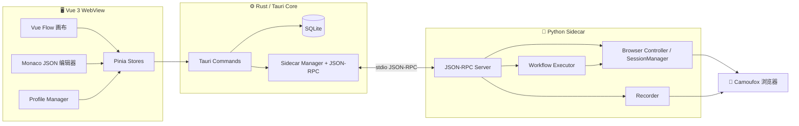

<p align="center">
  <strong>Mimicry</strong>
</p>

<p align="center">
  <strong>面向可视化浏览器自动化的本地优先桌面工作台</strong>
</p>

<p align="center">
  <a href="https://github.com/51hhh/Mimicry/actions/workflows/pipeline.yml">
    
  </a>
  <a href="https://github.com/51hhh/Mimicry/actions/workflows/release.yml">
    
  </a>
  <a href="https://github.com/51hhh/Mimicry/releases/latest">
    
  </a>
</p>

<p align="center">
  <a href="../README.md">English</a> | 中文
</p>

---

> 状态：**Alpha / MVP**。桌面壳、工作流画布、浏览器 sidecar、录制、执行、Profile 存储与多 session 基础能力均已就绪；设计文档中描述的部分高级工作流语义仍在落地中——见 [Roadmap](#roadmap)。

## Mimicry 是什么？

Mimicry 是一款基于 **Tauri v2 + Vue 3 + Rust + Python Sidecar** 构建的桌面浏览器自动化应用。你可以通过可视化画布编排浏览器工作流、录制真实浏览器交互、直接编辑工作流 JSON，并使用带独立数据目录与运行配置的隔离浏览器 Profile 启动自动化环境。

项目面向浏览器测试、重复网页操作、Profile 隔离工作流、可复现浏览器环境等本地自动化场景，自动化状态全部保存在本机，不依赖托管服务。

## 功能

- **可视化工作流编辑器** — 基于 Vue Flow 的画布，支持拖拽 action / condition / loop / group 节点
- **JSON 工作流编辑** — Monaco 编辑器，画布同步基础已就绪
- **浏览器 Sidecar** — Rust 通过 stdio 上的 JSON-RPC 2.0 与 Python sidecar 通信
- **Camoufox 集成** — 浏览器启动流程、环境检测、安装器、运行时警告
- **录制与回放** — 捕获真实浏览器交互并作为节点导入工作流
- **工作流执行器** — Python 引擎覆盖 browser、interaction、data、control、download、cookie、transform 等动作
- **Profile 管理** — 基于 SQLite 的 CRUD，支持每个 Profile 独立的 `user_data_dir`、代理、OS target、浏览器配置
- **Session 基础能力** — Sidecar `SessionManager` + 前端 session 状态，为多浏览器并发打基础
- **本地持久化** — SQLite 存储工作流、最近文件、设置和 Profile
- **桌面体验** — 自定义 Tauri 壳、ActivityBar/Sidebar、设置页、更新提示、i18n（en / zh-CN）、HiDPI 自适应

## Roadmap

下列条目明确属于待办，而非已交付能力：

- **工作流 schema 加固** — 更严格的校验、迁移诊断、围绕 canonical `kind + action + data + settings` 的前端转换测试
- **图执行语义** — 边、handle、分支、汇合点、loop 端口如何驱动执行顺序
- **Profile / Session 产品打磨** — 运行中 Profile 状态、删除保护、活跃 Session 展示、人工测试覆盖
- **工作流校验** — Schema 校验、迁移工具、非法节点诊断、更安全的 JSON 编辑
- **选择器自愈** — 将选择器评分扩展为运行时回退与修复流程
- **Package / 子工作流系统** — 可复用的分组工作流块及明确的 IO 契约
- **质量门禁** — 让前端 lint/typecheck、Rust 检查、Sidecar 测试在 CI 中持续绿色

## 快速开始

### 前置条件

- Rust 工具链
- Node.js ≥ 20，pnpm ≥ 10
- Python ≥ 3.10
- 对应平台的 Tauri v2 系统依赖

Ubuntu / Debian：

```bash
sudo apt install -y \
  libwebkit2gtk-4.1-dev build-essential curl wget file \
  libxdo-dev libssl-dev libayatana-appindicator3-dev librsvg2-dev pkg-config

cargo install tauri-cli --version "^2"
```

### 从源码运行

```bash
git clone https://github.com/51hhh/Mimicry.git
cd Mimicry

pnpm install
cargo tauri dev
```

`cargo tauri dev` 会通过 `pnpm dev` 启动 Vite 前端，并拉起 Rust 桌面壳。

### 构建

```bash
pnpm build
cargo tauri build
```

构建产物位于 `src-tauri/target/release/bundle/`。

### Sidecar 环境

Python Sidecar 负责驱动浏览器。开发模式下 App 可以在用户数据目录创建并使用 sidecar 虚拟环境；浏览器设置 UI 会检查 Camoufox 依赖并在缺失时引导安装。依赖列于：

- `sidecar/requirements.txt`
- `sidecar/requirements-dev.txt`

## 技术栈

| 层 | 技术 |
|---|------|
| 桌面壳 | [Tauri v2](https://v2.tauri.app/) |
| Rust 后端 | Tauri commands、[rusqlite](https://github.com/rusqlite/rusqlite)、JSON-RPC client、`tracing` |
| 前端 | [Vue 3](https://vuejs.org/)、Vite、TypeScript、Pinia、[Vue Flow](https://vueflow.dev/)、[Monaco](https://microsoft.github.io/monaco-editor/)、Tailwind CSS |
| 浏览器自动化 | Python、[Camoufox](https://github.com/daijro/camoufox)、Playwright APIs |
| IPC | Tauri invoke/events + 基于 stdio 的 JSON-RPC 2.0 |
| 存储 | SQLite |
| 打包 | Tauri bundler + Python sidecar 打包基础 |

## 架构



## 项目结构

```
src/                         # Vue 前端
├── components/              # UI、布局、编辑器、工作流节点组件
├── composables/             # 可复用的组合式工具
├── locales/                 # en / zh-CN 翻译
├── stores/                  # Pinia stores（browser、workflow、profiles、settings）
├── types/                   # TypeScript 契约
└── views/                   # 编辑器与设置视图

src-tauri/src/               # Rust 后端
├── commands/                # Tauri command 处理器
├── db/                      # SQLite schema 与数据访问
├── ipc/                     # Sidecar 进程与 JSON-RPC 客户端
├── error.rs                 # AppError / AppResult
├── lib.rs                   # Tauri 初始化
└── logger.rs                # tracing 配置

sidecar/                     # Python 自动化运行时
├── browser/                 # Camoufox controller、actions、recorder、profiles
├── engine/                  # 工作流执行器、动作映射
├── rpc/                     # JSON-RPC 服务、方法注册
├── tests/                   # Sidecar 单元 / e2e 测试
└── main.py                  # 入口

docs/                        # 架构、设计、工作流文档
shared/                      # 共享 action map 与跨层元数据
scripts/                     # 开发脚本
```

## 开发检查

```bash
# 前端
pnpm typecheck
pnpm lint

# Rust
cd src-tauri && cargo check
cd src-tauri && cargo test --all-targets --all-features
cd src-tauri && cargo clippy --all-targets --all-features -- -D warnings

# Python sidecar（先激活 sidecar 虚拟环境）
cd sidecar && python -m pytest
```

当前真实质量状态：

- 前端 `pnpm lint` 与 `pnpm typecheck` 通过。
- Rust 编译通过，但**目前没有** Rust 单元测试。
- Python sidecar 的 executor 与 action-map 测试在配置好的 sidecar 虚拟环境中通过。

## 贡献

欢迎贡献。重大改动请先开 issue 讨论。

1. Fork 仓库
2. 创建特性分支（`git checkout -b feat/amazing-feature`）
3. 提交修改（`git commit -m 'feat: add amazing feature'`）
4. 推送到远端（`git push origin feat/amazing-feature`）
5. 提交 Pull Request

在添加新功能之前，请优先稳定现有核心契约：保持 README 和文档与实现对齐，保持工作流 / Block JSON schema 显式且利于迁移，并为跨层契约补测试。

## 文档

- [文档索引](./README.md)
- [架构概览](./architecture.md)
- [Block 系统设计](./design/block-system.md)
- [数据流设计](./design/data-flow.md)

## 致谢

构建于以下开源项目：

- [Tauri](https://tauri.app/) — 桌面应用框架
- [Vue](https://vuejs.org/) — 前端框架
- [Vue Flow](https://vueflow.dev/) — 可视化节点编辑器
- [Monaco Editor](https://microsoft.github.io/monaco-editor/) — JSON 编辑
- [Camoufox](https://github.com/daijro/camoufox) — 浏览器自动化运行时
- [Playwright](https://playwright.dev/) — 浏览器自动化 API
- [rusqlite](https://github.com/rusqlite/rusqlite) — Rust 的 SQLite 绑定

## 许可证

仓库中目前未包含 `LICENSE` 文件。在公开分发前请先添加许可证。
