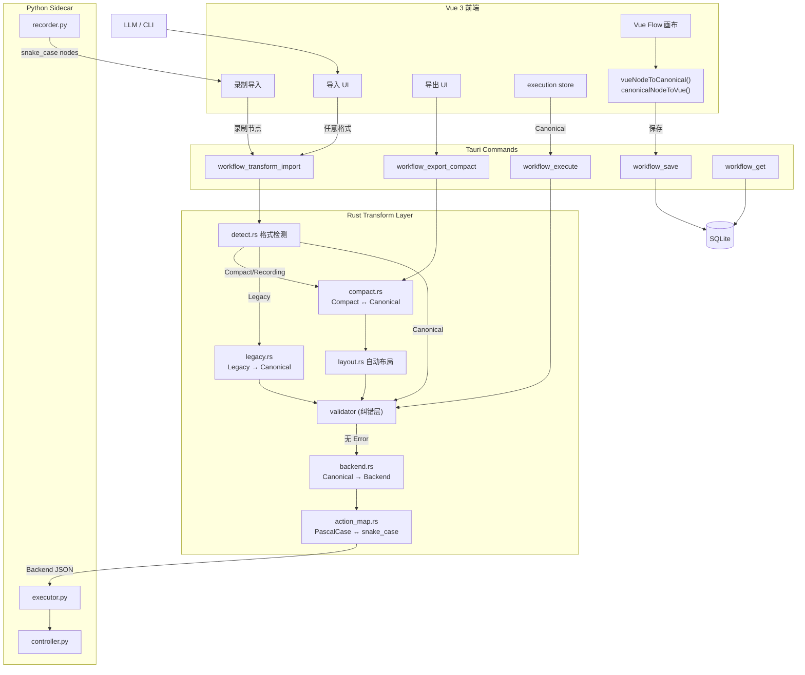

# 工作流转化层架构设计 (Workflow Transform Layer)

> **状态**: Implemented — 2026-05-02（5/1 layout 升级，分支偏移 commit `f064821`）
> **关联**: [block-system.md](block-system.md) | [data-flow.md](data-flow.md) | [decisions.md ADR-008](decisions.md#adr-008-rust-工作流转化层)
> **代码**: `src-tauri/src/transform/{mod,types,action_map,detect,compact,backend,layout,legacy}.rs` + `tests/transform_integration.rs`

---

## 1. 设计目标

将分散在三层（前端 TS / Rust / Python）的格式转换逻辑统一收敛到 **Rust 转化层**，使其成为所有工作流数据流经的唯一格式网关。

### 1.1 当前问题

```
前端: vueNodeToCanonical / canonicalNodeToVue / canonicalNodesToBackend / migrateLegacyWorkflow
Rust:  纯透传 serde_json::Value，不解析结构
Python: _normalize_node() 再次兜底归一化
```

- 格式转换散布三层，任一层改动都可能导致不一致
- Rust 层对 JSON 内部结构无感知，无法拦截格式错误
- CLI 导入/导出无格式校验，直接存取 SQLite
- LLM/外部工具无标准描述格式

### 1.2 目标状态

```
前端: 只处理 Vue Flow ↔ Canonical（UI 关注点）
Rust:  Canonical ↔ Compact / Canonical ↔ Backend / 格式检测 / 自动布局 / 校验
Python: 经 Rust 转换后收到可执行的 Backend 格式，_normalize_node() canonical 路径退化为 assert；legacy 路径保留以支持 CLI 直接调用
```

---

## 2. 格式定义

### 2.1 四种格式

| 格式 | 缩写 | 用途 | 命名风格 | 含 position | 含 edges |
|------|------|------|----------|:-----------:|:--------:|
| Vue Flow | `vue` | 画布内存态 | PascalCase | ✓ | ✓ |
| Canonical | `canonical` | 持久化/IPC/DB | PascalCase | ✓ | ✓ |
| Compact | `compact` | LLM/CLI 导入导出 | PascalCase | ✗ | ✗ |
| Backend | `backend` | Python 执行引擎 | snake_case（elseChildren 例外） | ✗ | ✗(数组顺序 + 嵌套) |

### 2.2 Compact 格式定义（新增）

LLM 友好、最小化、仅含执行语义的描述格式：

```jsonc
// Compact Workflow
{
  "name": "Bing 搜索 Bilibili",
  "description": "打开 Bing 搜索 Bilibili 并点击结果",  // 可选
  "nodes": [
    {
      "action": "Navigate",
      "data": { "url": "https://www.bing.com" },
      "note": "打开 Bing"                               // 可选，对应 settings.note
    },
    {
      "action": "Type",
      "data": { "selector": "#sb_form_q", "value": "Bilibili" }
    },
    {
      "action": "Click",
      "data": { "selector": "#sb_form_go" }
    },
    {
      "action": "Condition",
      "data": {
        "condition": "element_visible",
        "selector": "#b_results .b_algo"
      },
      "children": [
        { "action": "Click", "data": { "selector": "#b_results .b_algo:first-child a" } }
      ],
      "elseChildren": [
        { "action": "Log", "data": { "message": "No results found" } }
      ]
    }
  ]
}
```

**Compact 节点字段**：

| 字段 | 类型 | 必填 | 说明 |
|------|------|:----:|------|
| `action` | `string` | ✓ | PascalCase action 名 |
| `data` | `object` | ✓ | action 参数 |
| `note` | `string` | ✗ | 人类可读注释 → `settings.note` |
| `settings` | `object` | ✗ | 高级设置（onError / retry 等），大多场景省略 |
| `children` | `CompactNode[]` | ✗ | condition/loop 的 true 分支 |
| `elseChildren` | `CompactNode[]` | ✗ | condition 的 false 分支 |
| `id` | `string` | ✗ | 导入时自动生成 |
| `kind` | `string` | ✗ | 根据 action 自动推断 |

**推断规则**：
- `action == "Condition"` → `kind = "condition"`，Canonical 中 **不设置** `action` 字段（condition 由 kind 驱动执行）
- `action` 含 `Loop` 前缀（如 `LoopElements`）→ `kind = "loop"`，保留 action 做正常映射
- `action == "Group"` → `kind = "group"`，Canonical 中 **不设置** `action` 字段
- 其余 → `kind = "action"`
- action 可以是 PascalCase 或 snake_case（导入时自动检测并统一为 PascalCase）

**Compact 与 Canonical 的核心差异**：
- 无 `id`（自动生成 `node_{uuid}`）
- 无 `position`（自动布局）
- 无 `edges`（根据数组顺序 + 嵌套关系自动生成）
- 无 `runtime`（默认 `sessionId: "default"`）
- `note` 提升到节点顶层（简化 LLM 输出）

### 2.3 Backend 格式定义（Rust 输出）

Rust 层转换后直接交给 Python 的格式：

```jsonc
{
  "id": "node_abc123",
  "kind": "action",
  "type": "action",           // kind 的副本，兼容 Python
  "action": "click",          // snake_case
  "data": { "selector": "#btn" },
  "settings": { "onError": "stop", "disabled": false },
  "session_id": "default",    // 从 runtime.sessionId 提取并 snake_case
  "children": [],              // 从 data.children 提取到顶层
  "elseChildren": []           // 从 data.elseChildren 提取到顶层
}
```

---

## 3. Rust 数据结构

### 3.1 核心类型 (`src-tauri/src/transform/types.rs`)

```rust
use serde::{Deserialize, Serialize};
use std::collections::HashMap;

/// 节点类型
#[derive(Debug, Clone, Serialize, Deserialize, PartialEq)]
#[serde(rename_all = "camelCase")]
pub enum NodeKind {
    Action,
    Condition,
    Loop,
    Group,
}

/// 画布位置
#[derive(Debug, Clone, Serialize, Deserialize)]
pub struct Position {
    pub x: f64,
    pub y: f64,
}

/// 节点设置
#[derive(Debug, Clone, Default, Serialize, Deserialize)]
#[serde(rename_all = "camelCase")]
pub struct NodeSettings {
    #[serde(skip_serializing_if = "Option::is_none")]
    pub on_error: Option<String>,
    #[serde(skip_serializing_if = "Option::is_none")]
    pub disabled: Option<bool>,
    #[serde(skip_serializing_if = "Option::is_none")]
    pub retry_on_fail: Option<bool>,
    #[serde(skip_serializing_if = "Option::is_none")]
    pub retry_count: Option<u32>,
    #[serde(skip_serializing_if = "Option::is_none")]
    pub retry_interval: Option<u32>,
    #[serde(skip_serializing_if = "Option::is_none")]
    pub note: Option<String>,
    /// 允许未知 settings 字段透传
    #[serde(flatten)]
    pub extra: HashMap<String, serde_json::Value>,
}

/// 运行时配置
#[derive(Debug, Clone, Default, Serialize, Deserialize)]
#[serde(rename_all = "camelCase")]
pub struct NodeRuntime {
    #[serde(skip_serializing_if = "Option::is_none")]
    pub session_id: Option<String>,
    #[serde(flatten)]
    pub extra: HashMap<String, serde_json::Value>,
}

// ─── Canonical Format ────────────────────────────────────────────

/// Canonical 节点 — DB 持久化 & IPC 传输格式
#[derive(Debug, Clone, Serialize, Deserialize)]
#[serde(rename_all = "camelCase")]
pub struct CanonicalNode {
    pub id: String,
    pub kind: NodeKind,
    #[serde(skip_serializing_if = "Option::is_none")]
    pub action: Option<String>,
    pub position: Position,
    #[serde(default)]
    pub data: serde_json::Value,
    #[serde(skip_serializing_if = "Option::is_none")]
    pub settings: Option<NodeSettings>,
    #[serde(skip_serializing_if = "Option::is_none")]
    pub runtime: Option<NodeRuntime>,
    #[serde(skip_serializing_if = "Option::is_none")]
    pub selected: Option<bool>,
}

/// Canonical 边
#[derive(Debug, Clone, Serialize, Deserialize)]
#[serde(rename_all = "camelCase")]
pub struct CanonicalEdge {
    pub id: String,
    pub source: String,
    pub target: String,
    #[serde(skip_serializing_if = "Option::is_none")]
    pub source_handle: Option<String>,
    #[serde(skip_serializing_if = "Option::is_none")]
    pub target_handle: Option<String>,
    #[serde(skip_serializing_if = "Option::is_none")]
    pub label: Option<String>,
    /// Vue Flow 渲染元数据透传
    #[serde(flatten)]
    pub extra: HashMap<String, serde_json::Value>,
}

/// Canonical 工作流 — 完整文档
/// id/created_at/updated_at 为可选，因为执行链路只传 nodes+edges
#[derive(Debug, Clone, Serialize, Deserialize)]
#[serde(rename_all = "camelCase")]
pub struct CanonicalWorkflow {
    #[serde(default)]
    pub id: Option<String>,
    #[serde(default)]
    pub name: Option<String>,
    pub nodes: Vec<CanonicalNode>,
    #[serde(default)]
    pub edges: Vec<CanonicalEdge>,
    #[serde(default)]
    pub created_at: Option<String>,
    #[serde(default)]
    pub updated_at: Option<String>,
}

// ─── Compact Format ──────────────────────────────────────────────

/// Compact 节点 — LLM/CLI 描述格式
#[derive(Debug, Clone, Serialize, Deserialize)]
#[serde(rename_all = "camelCase")]
pub struct CompactNode {
    pub action: String,
    #[serde(default)]
    pub data: serde_json::Value,
    #[serde(skip_serializing_if = "Option::is_none")]
    pub note: Option<String>,
    #[serde(skip_serializing_if = "Option::is_none")]
    pub settings: Option<NodeSettings>,
    #[serde(skip_serializing_if = "Option::is_none")]
    pub children: Option<Vec<CompactNode>>,
    #[serde(skip_serializing_if = "Option::is_none")]
    pub else_children: Option<Vec<CompactNode>>,
    // 可选字段（导入时可提供，否则自动生成）
    #[serde(skip_serializing_if = "Option::is_none")]
    pub id: Option<String>,
    #[serde(skip_serializing_if = "Option::is_none")]
    pub kind: Option<NodeKind>,
}

/// Compact 工作流 — 最小描述文档
#[derive(Debug, Clone, Serialize, Deserialize)]
pub struct CompactWorkflow {
    pub name: String,
    #[serde(skip_serializing_if = "Option::is_none")]
    pub description: Option<String>,
    pub nodes: Vec<CompactNode>,
}

// ─── Backend Format ──────────────────────────────────────────────

/// Backend 节点 — Python executor 直接消费
#[derive(Debug, Clone, Serialize, Deserialize)]
pub struct BackendNode {
    pub id: String,
    pub kind: String,          // "action" | "condition" | "loop" | "group"
    #[serde(rename = "type")]
    pub node_type: String,     // kind 的副本
    pub action: String,        // snake_case
    pub data: serde_json::Value,
    #[serde(default)]
    pub settings: serde_json::Value,
    pub session_id: String,
    #[serde(default)]
    pub children: Vec<BackendNode>,
    #[serde(default, rename = "elseChildren")]
    pub else_children: Vec<BackendNode>,
}

/// Backend 工作流 — 发送给 Python sidecar
#[derive(Debug, Clone, Serialize, Deserialize)]
pub struct BackendWorkflow {
    pub name: String,
    pub nodes: Vec<BackendNode>,
}
```

### 3.2 Action Map (`src-tauri/src/transform/action_map.rs`)

```rust
use std::collections::HashMap;
use std::sync::LazyLock;

/// PascalCase → snake_case 映射（编译时从 shared/action-map.json 生成）
static TO_BACKEND: LazyLock<HashMap<&str, &str>> = LazyLock::new(|| {
    serde_json::from_str::<HashMap<&str, &str>>(
        include_str!("../../../shared/action-map.json")
    ).expect("invalid action-map.json")
});

/// snake_case → PascalCase 反向映射
static TO_FRONTEND: LazyLock<HashMap<&str, &str>> = LazyLock::new(|| {
    TO_BACKEND.iter().map(|(&k, &v)| (v, k)).collect()
});

pub fn to_backend(pascal: &str) -> String {
    TO_BACKEND.get(pascal).map(|s| s.to_string())
        .unwrap_or_else(|| pascal.to_string())
}

pub fn to_frontend(snake: &str) -> String {
    TO_FRONTEND.get(snake).map(|s| s.to_string())
        .unwrap_or_else(|| snake.to_string())
}
```

---

## 4. 转换接口

### 4.1 模块结构 (`src-tauri/src/transform/`)

```
src-tauri/src/transform/
├── mod.rs              // pub mod 声明
├── types.rs            // §3.1 数据结构
├── action_map.rs       // §3.2 action 名映射
├── detect.rs           // §4.2 格式自动检测
├── compact.rs          // §4.3 Compact ↔ Canonical
├── backend.rs          // §4.4 Canonical → Backend
├── layout.rs           // §4.5 自动布局引擎
└── legacy.rs           // §4.6 Legacy 兼容迁移
```

### 4.2 格式检测 (`detect.rs`)

```rust
/// 检测输入 JSON 的格式类型
pub enum WorkflowFormat {
    Canonical,  // 有 position + edges + kind
    Compact,    // 无 position，有 action，节点为数组
    Recording,  // 有 kind，无 position，action 为 snake_case（录制器输出）
    Legacy,     // 有 type（非 kind），扁平 data
    Unknown,
}

pub fn detect_format(json: &serde_json::Value) -> WorkflowFormat;
```

**检测逻辑**：
1. 根对象有 `edges`（非空）且节点有 `position` + `kind` → `Canonical`
2. 根对象无 `edges`（或 edges 为空），节点有 `action` 无 `position` → `Compact`（action 可为 PascalCase 或 snake_case）
3. 节点有 `type`（非 `kind`），action 字段扁平存放 → `Legacy`
4. 节点有 `kind` 但无 `position`，action 为 snake_case → `Recording`（录制输出格式）
5. 其余 → `Unknown`（返回错误）

### 4.3 Compact ↔ Canonical (`compact.rs`)

```rust
/// Compact → Canonical（导入方向）
/// 1. 推断 kind
/// 2. 生成 id（uuid）
/// 3. note → settings.note
/// 4. 自动布局生成 position（调用 layout::auto_layout）
/// 5. 根据数组顺序 + 嵌套关系生成 edges
pub fn compact_to_canonical(compact: &CompactWorkflow) -> Result<CanonicalWorkflow, TransformError>;

/// Canonical → Compact（导出方向）
/// 1. 剥离 position / edges / runtime / selected
/// 2. settings.note → 顶层 note
/// 3. 嵌套 children（如果 edge 表示父子关系）
pub fn canonical_to_compact(canonical: &CanonicalWorkflow) -> Result<CompactWorkflow, TransformError>;
```

### 4.4 Canonical → Backend (`backend.rs`)

```rust
/// Canonical → Backend（执行方向）
/// 1. action PascalCase → snake_case
/// 2. data.children / data.elseChildren → 顶层 children/elseChildren（递归转换）
/// 3. runtime.sessionId → session_id
/// 4. 移除 position / selected / edges
pub fn canonical_to_backend(
    canonical: &CanonicalWorkflow,
    session_id: &str,
) -> Result<BackendWorkflow, TransformError>;
```

### 4.5 自动布局 (`layout.rs`)

```rust
/// 自动布局参数
pub struct LayoutConfig {
    pub start_x: f64,       // 默认 300.0
    pub start_y: f64,       // 默认 100.0
    pub x_gap: f64,         // 水平间距，默认 250.0
    pub y_gap: f64,         // 垂直间距，默认 120.0
    pub branch_offset: f64, // condition 分支偏移，默认 300.0
}

/// 对无位置的节点列表生成 position + edges
pub fn auto_layout(
    nodes: &[CompactNode],
    config: &LayoutConfig,
) -> (Vec<Position>, Vec<CanonicalEdge>);
```

**布局算法**（Phase 1 — 简单自上而下）：
1. 顺序节点：垂直排列，每节点 `y += y_gap`
2. Condition 节点：true 分支向左偏移，false 分支向右偏移，各自垂直排列
3. Loop 节点：children 缩进布局
4. 分支/循环结束后，汇合点 y 取最大值 + gap

**Phase 1 限制**：深层嵌套（condition 内嵌 loop 内嵌 condition）可能出现节点重叠，因为 `branch_offset` 是固定值。后续版本升级为树布局算法或集成 dagre/ELK。

### 4.6 Legacy 兼容 (`legacy.rs`)

```rust
/// Legacy 扁平格式 → Canonical
/// 1. type → kind
/// 2. 扁平字段（selector/url/value）→ data 对象
/// 3. action 保持原名（可能是 snake_case → to_frontend 转换）
/// 4. 补全缺失的 id / position / settings
pub fn legacy_to_canonical(json: &serde_json::Value) -> Result<CanonicalWorkflow, TransformError>;
```

---

## 5. Tauri Command 接口

### 5.1 新增/修改的 Commands

```rust
// ─── 新增 ───────────────────────────────────────────────

/// 通用导入：自动检测格式 → 统一转为 Canonical
#[tauri::command]
pub fn workflow_transform_import(
    json: serde_json::Value,
) -> Result<CanonicalWorkflow, AppError>;

/// 导出为 Compact 格式（LLM 友好）
#[tauri::command]
pub fn workflow_export_compact(
    workflow: CanonicalWorkflow,
) -> Result<CompactWorkflow, AppError>;

/// 格式检测
#[tauri::command]
pub fn workflow_detect_format(
    json: serde_json::Value,
) -> Result<String, AppError>;  // "canonical" | "compact" | "legacy" | "unknown"

// ─── 修改 ───────────────────────────────────────────────

/// workflow_execute：增加 Canonical → Backend 转换
#[tauri::command]
pub async fn workflow_execute(
    sidecar: State<'_, Mutex<Sidecar>>,
    workflow: serde_json::Value,
    session_id: Option<String>,
    humanize: Option<bool>,
    delay_multiplier: Option<f64>,
) -> Result<serde_json::Value, AppError> {
    // 1. 验证（已有）
    let diags = validate(&workflow);
    if has_errors(&diags) { return Err(...); }

    // 2. 【新增】格式检测 + Canonical → Backend 转换
    let fmt = detect_format(&workflow);
    if fmt == WorkflowFormat::Unknown {
        return Err(AppError::Transform("Unrecognized workflow format".into()));
    }
    let canonical: CanonicalWorkflow = serde_json::from_value(workflow)?;
    let sid = session_id.unwrap_or("default".into());
    let backend = canonical_to_backend(&canonical, &sid)?;

    // 3. 发送已转换的 Backend 格式给 Python
    sidecar_call(sidecar, "workflow.execute", Some(json!({
        "workflow": backend,
        "session_id": sid,
        "humanize": humanize.unwrap_or(true),
        "delay_multiplier": delay_multiplier.unwrap_or(1.0),
    }))).await
}

/// workflow_import：增加格式检测 + 转换
#[tauri::command]
pub async fn workflow_import(
    db_conn: State<'_, Mutex<Connection>>,
    json: String,
) -> Result<usize, AppError> {
    let value: serde_json::Value = serde_json::from_str(&json)?;
    let format = detect_format(&value);
    let canonical = match format {
        Canonical => serde_json::from_value(value)?,
        Compact | Recording => compact_to_canonical(&serde_json::from_value(value)?)?,
        Legacy    => legacy_to_canonical(&value)?,
        Unknown   => return Err(AppError::Transform("Unknown workflow format")),
    };
    // 存入 DB
    ...
}

/// workflow_export：支持格式选择
#[tauri::command]
pub async fn workflow_export(
    db_conn: State<'_, Mutex<Connection>>,
    format: Option<String>,  // "canonical" | "compact"，默认 canonical
) -> Result<String, AppError>;
```

### 5.2 前端调用变更

| 前端操作 | 当前调用 | 重构后调用 |
|---------|---------|-----------|
| 保存工作流 | `workflow_save(canonical)` | 不变 |
| 加载工作流 | `workflow_get` → `canonicalNodeToVue()` | 不变（Canonical 格式不变） |
| 执行工作流 | `canonicalNodesToBackend()` → `workflow_execute(backend)` | **`workflow_execute(canonical)`**（Rust 做转换） |
| 导入文件 | `workflow_import(json)` 直接存 | **`workflow_transform_import(json)`** → 前端拿 Canonical 加载 |
| 导出文件 | `workflow_export()` 从 DB 读 | **`workflow_export(format)` 支持 compact** |
| 录制导入 | `importRecordedNodes()` 手动构造 | **`workflow_transform_import(recordingJson)`** |

---

## 6. 数据流程图

### 6.1 总览（Mermaid）



### 6.2 ASCII 总览

```
                    ┌─────────────────────────────────────────────────┐
                    │              Rust Transform Layer               │
                    │                                                 │
  ┌──────────┐     │  ┌──────────┐   ┌───────────┐   ┌───────────┐  │     ┌──────────┐
  │ Vue Flow │────►│  │ detect() │──►│ compact   │──►│ canonical │  │────►│ SQLite   │
  │ (画布)   │◄────│  │          │   │ _to_      │   │           │  │◄────│ (DB)     │
  └──────────┘     │  │          │   │ canonical │   │           │  │     └──────────┘
                   │  └──────────┘   └───────────┘   └─────┬─────┘  │
  ┌──────────┐     │  ┌──────────┐   ┌───────────┐        │        │
  │ LLM JSON │────►│  │ legacy   │──►│ canonical │        │        │
  │ (导入)   │     │  │ _to_     │   │ _to_      │        ▼        │     ┌──────────┐
  └──────────┘     │  │ canonical│   │ compact   │   ┌─────────┐   │────►│ Python   │
                   │  └──────────┘   └───────────┘   │canonical│   │     │ Executor │
  ┌──────────┐     │                                 │ _to_    │   │     └──────────┘
  │ CLI JSON │────►│                                 │ backend │   │
  │ (导入)   │     │                                 └─────────┘   │
  └──────────┘     │                                               │
                   │  ┌──────────────────────────────────────────┐  │
                   │  │ auto_layout() — 自动生成 position/edges  │  │
                   │  └──────────────────────────────────────────┘  │
                   └─────────────────────────────────────────────────┘
```

### 6.2 执行链路（重构后）

```
前端 execute()
  │ workflow = store.toJSON()           // Canonical, PascalCase
  │ ❌ 不再调用 canonicalNodesToBackend()
  │
  ▼
invoke("workflow_execute", { workflow })
  │
  ▼ Rust
  │ 1. validate(workflow)               // 已有
  │ 2. canonical_to_backend(workflow)   // 【新增】
  │    ├─ PascalCase → snake_case
  │    ├─ data.children → 顶层 children
  │    └─ runtime.sessionId → session_id
  │ 3. sidecar_call("workflow.execute", backend_workflow)
  │
  ▼ Python
  │ executor.execute(workflow)
  │ _normalize_node() → 仅 assert 格式正确（兜底）
```

### 6.3 导入链路（重构后）

```
用户拖入文件 / 粘贴 / CLI import
  │
  ▼
invoke("workflow_transform_import", { json })
  │
  ▼ Rust
  │ 1. detect_format(json)
  │    ├─ Compact?  → compact_to_canonical()
  │    │              ├─ 推断 kind
  │    │              ├─ 生成 id (uuid)
  │    │              ├─ auto_layout() → position + edges
  │    │              └─ note → settings.note
  │    ├─ Legacy?   → legacy_to_canonical()
  │    │              ├─ type → kind
  │    │              ├─ 扁平字段 → data
  │    │              └─ snake_case → PascalCase
  │    └─ Canonical? → 直接解析校验
  │ 2. validate(canonical) → 返回诊断信息
  │ 3. 返回 CanonicalWorkflow
  │
  ▼ 前端
  │ canonicalNodeToVue() → 加载到画布
  │ 或直接存入 DB
```

### 6.4 导出链路（重构后）

```
用户点击导出
  │ 选择格式：Canonical / Compact
  │
  ▼ Canonical 导出
  │ workflow_get(id) → 直接输出 JSON 文件
  │
  ▼ Compact 导出
  │ invoke("workflow_export_compact", { workflow })
  │   Rust:
  │   ├─ 剥离 position / edges / selected
  │   ├─ settings.note → 顶层 note
  │   └─ 输出 CompactWorkflow JSON
```

---

## 7. 错误处理

```rust
#[derive(Debug, thiserror::Error)]
pub enum TransformError {
    #[error("Unknown workflow format")]
    UnknownFormat,

    #[error("Missing required field: {field} in node {node_id}")]
    MissingField { node_id: String, field: String },

    #[error("Unknown action: {action}")]
    UnknownAction { action: String },

    #[error("Invalid node kind: {kind}")]
    InvalidKind { kind: String },

    #[error("JSON deserialization error: {0}")]
    Json(#[from] serde_json::Error),

    #[error("Layout error: {0}")]
    Layout(String),
}

// TransformError → AppError 转换
// 注意：不要映射到 AppError::Sidecar，那是 Python 端错误
impl From<TransformError> for AppError {
    fn from(e: TransformError) -> Self {
        AppError::Transform(e.to_string())  // 需在 AppError 新增 Transform 变体
    }
}
```

---

## 8. 前端变更清单

### 8.1 删除/简化

| 文件 | 变更 |
|------|------|
| `src/stores/execution.ts` | 删除 `canonicalNodesToBackend()`，直接传 Canonical 给 Rust |
| `src/stores/execution.ts` | 删除 `import { toBackend }` |
| `src/utils/workflowSchema.ts` | `migrateLegacyWorkflow()` 标记废弃（Rust 接管） |

### 8.2 保留不变

| 文件 | 原因 |
|------|------|
| `src/utils/workflowSchema.ts` | `vueNodeToCanonical()` / `canonicalNodeToVue()` — UI 关注点，保持前端 |
| `src/utils/workflowSchema.ts` | `validateCanonicalNode()` — 前端实时校验用，保留 |
| `src/types/action-map.ts` | `toFrontend()` 仍需用于录制节点的 action 名转换显示 |

### 8.3 新增/修改

| 文件 | 变更 |
|------|------|
| `src/stores/workflow.ts` | 导入流程改为调用 `workflow_transform_import` |
| `src/stores/browser.ts` | 录制节点导入：先包装为 `{name: "Recording", nodes: [...]}` 再调用 `workflow_transform_import` |
| `src/components/editor/` | 导入 UI 增加格式选择（或自动检测提示） |
| `src/components/editor/` | 导出 UI 增加 Compact 选项 |

---

## 9. Python 变更清单

| 文件 | 变更 |
|------|------|
| `sidecar/engine/executor.py` | `_normalize_node()` canonical 路径简化为断言；legacy 路径保留完整转换能力（支持 CLI 直接调用） |
| `sidecar/engine/action_map.py` | 保留但不再是执行链路必经点（Rust 已转换） |
| `sidecar/cli.py` | `cmd_run` 改为先调用 Rust 转换 API（或内嵌简单归一化） |

**CLI 特殊处理**：CLI 不经过 Tauri，直接调用 Python。两种方案：
- **A**: CLI 保留 `_normalize_node()` 兜底能力，接受任意格式
- **B**: CLI 加一个 `--format` 参数，或内嵌 Compact→Backend 转换

推荐 **A**：CLI 保留兼容能力，`_normalize_node()` 不删除只简化。

---

## 10. 实施阶段

### Phase 1：Rust 核心转换 ✅

1. 新建 `src-tauri/src/transform/` 模块
2. 实现 `types.rs` — 所有结构体定义
3. 实现 `action_map.rs` — include_str 编译期加载
4. 实现 `detect.rs` — 格式检测
5. 实现 `backend.rs` — Canonical → Backend
6. 实现 `compact.rs` — Compact ↔ Canonical
7. 实现 `layout.rs` — 自动布局（简单线性版）
8. 实现 `legacy.rs` — Legacy → Canonical
9. 单元测试全覆盖（97 unit tests）

### Phase 2：接入执行链路 ✅

1. `workflow_execute` 增加 `canonical_to_backend()` 调用
2. 前端 `execution.ts` 删除 `canonicalNodesToBackend()`
3. Python `_normalize_node()` 简化为断言
4. 集成测试验证执行链路（5 integration tests）

### Phase 3：接入导入导出 ✅

1. 新增 `workflow_transform_import` command — 自动检测格式 → Canonical
2. 新增 `workflow_export_compact` command — Canonical → Compact
3. 新增 `workflow_detect_format` command — 格式检测
4. 新增 `file_import` command — 读文件 + 格式检测 + 转 Canonical
5. 新增 `file_export_compact` command — Canonical → Compact 写磁盘
6. 前端 `useFileOps` 增加 `importFile()` / `exportCompact()`
7. `applyJsonText()` 改为 async，优先走 Rust 转换（fallback 前端迁移）

### Phase 4：清理 & 文档 ✅

1. 移除前端废弃代码（`toBackend()` 函数）
2. 更新同步脚本 `sync-action-map.py`
3. 更新本设计文档状态
4. `migrateLegacyWorkflow` 保留为 fallback（Rust 转换失败时兜底）

---

## 11. 测试策略

| 测试类型 | 覆盖范围 | 文件 |
|---------|---------|------|
| Rust 单元测试 | 每个转换函数的正常/边界/错误路径 | `src-tauri/src/transform/*` |
| Rust 集成测试 | detect → convert → validate 全链路 | `src-tauri/tests/transform_integration.rs` |
| 前端快照测试 | canonicalNodeToVue 不受影响 | 已有 |
| Python 回归 | executor 接收 Backend 格式正常执行 | `sidecar/tests/test_executor.py` |
| E2E | Bing 搜索工作流全链路 | `sidecar/tests/test_blocks_e2e.py` |
| 往返测试 | Canonical → Compact → Canonical **执行语义**不变（action/data/settings/嵌套/顺序一致，不含 position/edges/runtime） | Rust 单元测试 |

---

## 12. 与现有系统的关系

```
┌──────────────────────────────────────────────────────┐
│                    Rust 层                            │
│                                                      │
│  ┌─────────────────┐    ┌──────────────────────────┐ │
│  │ workflow_        │    │ transform/               │ │
│  │ validator.rs     │    │   detect → convert →     │ │
│  │ (纠错层 — 已完成) │    │   layout → backend      │ │
│  │ 37 rules         │    │ (转化层 — 本次实现)       │ │
│  └────────┬─────────┘    └────────────┬─────────────┘ │
│           │                           │               │
│           ▼                           ▼               │
│    workflow_execute() ─── validate → transform → call │
│                                                      │
└──────────────────────────────────────────────────────┘
```

**纠错层**（validator）：静态分析，返回诊断信息，已完成
**转化层**（transform）：格式转换，自动布局，本次实现
两者在 `workflow_execute` 中串联：先 validate → 再 transform → 最后 sidecar_call
